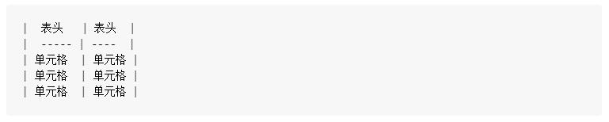
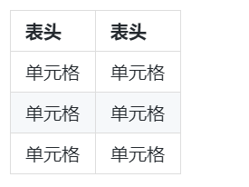

# Markdown 基础语法

* 这是一个语法字典，可以根据右边的索引自行查找格式语法。每个索引中含有语法和显示结果。
* 如果想要学习更多 Markdown 语法，可以去 [Markdown - 语法说明](http://www.markdown.cn/) 学习。
* 如果想要试试功能全面、操作便捷的 Markdown 编辑器，[MdEditor](https://www.mdeditor.com/) 是个不错的选择。
* VSCode中，拓展"Office Viewer"提供了“代码/可视化快捷切换”的双重 Markdown 编辑体验。

## 标题

```
# 一级标题
## 二级标题
### 三级标题
#### 四级标题
##### 五级标题
```

注：展示标题显示结果的话，会影响目录显示，所以在此就不做展示了~

<div id="font"></div>

## 字体

```
*斜体文本*
**粗体文本**
***粗斜体***
```

*斜体文本*
**粗体文本**
***粗斜体***

## 无序列表

```
* 第一项
* 第二项
* 第三项
```

* 第一项
* 第二项
* 第三项

## 有序列表

```
1. 第一项
2. 第二项
3. 第三项
```

1. 第一项
2. 第二项
3. 第三项

## 下划线

```
<u>带下划线的文本</u>
```

`<u>`带下划线的文本 `</u>`

## 删除线

```
~~要删除的文本~~
```

~~要删除的文本~~

## 代码

```
`代码`
```

`代码`

## 引用

```
> 引用的文本
```

> 引用的文本

## 链接

```
[链接名称](链接地址)
```

[链接名称](https://boobyuuuu.github.io/SR)

## 图片

```

```


## 表格





---

## 锚点链接

此处以对上文 `字体`标题锚点链接为例：[点击链接到 `字体`](#font)。

此处可能需要一点 HTML 知识。在目标地点 `字体`标题附近添加一个带有独一 `id`属性的标签，比如 `<div id="font"></div>`，然后利用 `id`实现页面内的跳转，语法如下：

```
[点击链接到字体](#font)
```
