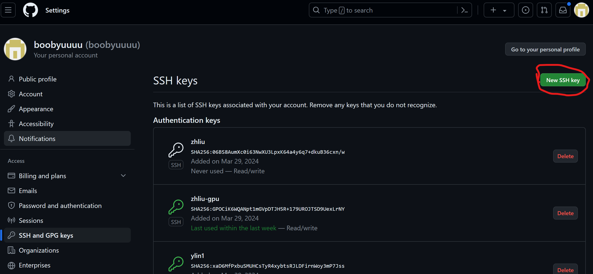

# Git 与 Github 操作

## HTTPS和SSH原理解释

可以理解为设备先代码先推送到你的Github账户，Github再判断你是否有权限将代码推送到仓库。

HTTPS和SSH就是建立“上传代码的机器”和“Github账户”之间联系的两个协议。就是你登录Github的两种输密码的方式。

使用HTTPS会让你手动输入一次密码，后面不用再输了；使用SSH会让你一次性生成密钥，放入你的个人文件，后面也不用再输了。

HTTPS有时候会被墙（尤其是服务器环境），SSH网络非常好。

**一台机器可以有多个SSH密钥组！一个账号也可以有多个SSH公钥！**


例：

每个人将服务器的文件备份到SR这个项目（在lzh的github下）中，均使用的是lzh的id_rsa.pub文件。

每个人将服务器的文件备份到VAE256这个项目（在ly的github下）中，均使用的是ylin_rsa.pub文件

ly将自己电脑上的文件备份到VAE256这个项目（在ly的github下），使用的是自己电脑上的另一个公钥，比如也叫ylin_rsa.pub文件（内容一定是不一样的）。

## 初始上传（默认HTTPS上传）

1 本地上传缓存

```
git init
git add . #上传所有文件，这样注释也是对所有进行注释
git commit -m "注释"
```

2 与远程仓库关联

```
git remote add connect_name <GitHub 仓库地址>

```

查看已经有的connect name：

```
git remote -v
```

3 建立本地的分支

```
git branch <branch_name> #创建一个本地分支
git checkout -b <branch_name> <connect_name>/<remote_branch_name> #创建一个与远程关联的本地分支
git checkout <branch_name> #切换到 branch_name
git branch #查看所有本地分支
git branch -r #查看当前远程分支
```

4 上传

```
git push <connect_name> <your_branch_name> 将`your_branch_name`分支上传到远程仓库`connect_name`，并且在并在远程仓库中创建一个名为`your_branch_name`的远程分支<remote_name>=<your_branch_name>

git push -u <remote_name> <branch_name> #将当前分支的更改推送到远程仓库，并将本地分支与远程分支进行关联
```

*注：分支操作比较复杂，一般不会用到*

## Git 的 SSH 上传（gpu建议使用）

1 在本地生成一个SSH

```
$ ssh-keygen -t rsa -C '[邮箱]' -f ~/.ssh/[你的名字]_rsa
连带方括号进行个人的修改
```

这里的邮箱没有任何用，只是用来分辨ssh公钥是谁的。

> ***一台机器可以有多个SSH密钥组，一个账号也可以有多个SSH公钥。***

2 查看公钥

```
cat ~/.ssh/id_rsa.pub
```

3 复制到Github仓库中的相应位置



4 检查SSH连接成功

```
ssh -T git@github.com
```

输出以下则连接成功：

```
Hi boobyuuuu! You've successfully authenticated, but GitHub does not provide shell access.
```

5 将 `connect_name`改为SSH连接

```
git remote set-url connect_name git@github.com:boobyuuuu/SR.git
```

6 正常上传

## 如果对自己的上传的注释不满意，想要修改上次的注释

```
git commit --amend #会打开一个vim文件
```

附带vim操作介绍：

```
#INSERT模式：
i
#退出：
Esc : q #直接退出
Esc : wq #保存后退出
```

## 如果想要回溯至之前某一次上传的状态

查看之前push记录

```
git reflog
```

可以得到一系列的ID

回溯到某一个ID

```
git reset --hard <commit_id>
```
