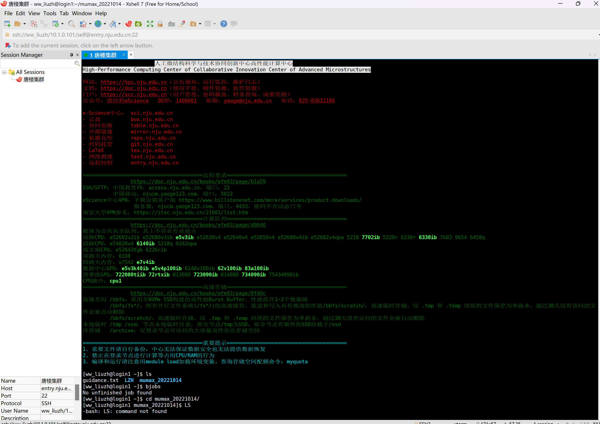
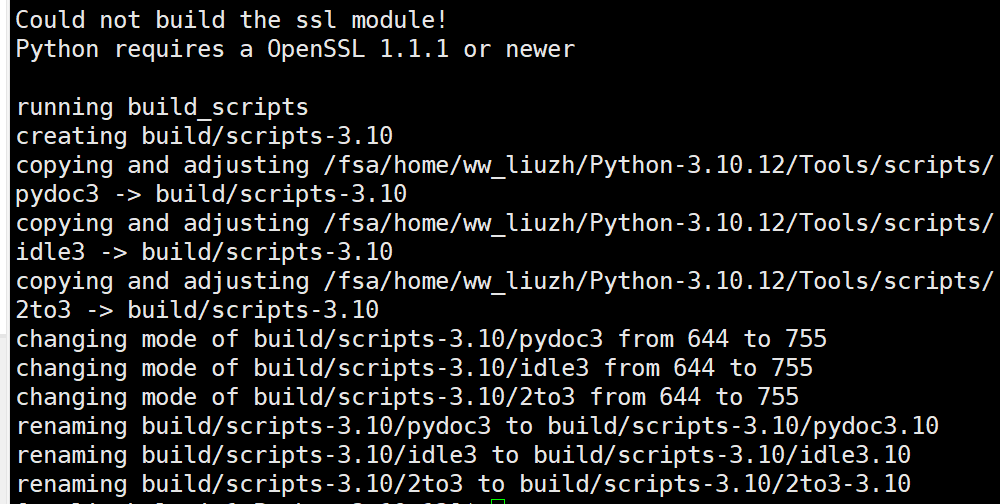

# 超算使用文档

## 相关网址

管理超算账户的主页：
https://scc.nju.edu.cn/

超算2024极简版文档：
https://doc.nju.edu.cn/books/efe93/page/2024-87J

进入超算login账户：（需要两步认证）
https://entry.nju.edu.cn/

收费方法：
https://hpc.nju.edu.cn/zh/hpc/3119-charges

所有计算资源：
https://doc.nju.edu.cn/books/efe93/page/d9640

## 账号 密码

ww_liuzh

8HSu_qL6

## 运行我们的任务需要的操作

1.登陆账号，进入超算login账户



2.将我们的任务文档传输到一个新文件夹

3.在新文件夹建立运行文档

```
vim job.lsf
```

一个运行文档的示例

```vim linenums="1"
#!/bin/bash
#BSUB -J my_job_name
#BSUB -q my_queue
#BSUB -n 1
#BSUB -W 1:00
#BSUB -gpu num=2
#BSUB -o output.txt
#BSUB -e error.txt

python3 my_script.py
```

4.提交作业

```bash
bsub < job.lsf
```

检查作业

```bash
bjobs
```

删除作业

```bash
bkill id
```

## 配置环境-编译版python(不适合无权限服务器，请看后面的anaconda)

### 1 下载Python3.10

**下载 Python 源代码**

```
wget https://www.python.org/ftp/python/3.10.12/Python-3.10.12.tgz
```

**解压源代码：**
解压下载的源代码压缩包，进入解压后的目录：

```
tar -zxvf Python-3.10.12.tgz
cd Python-3.10.12
```

**配置安装目录：**
在此步骤中，您可以指定安装 Python 的目标目录，即 --prefix 参数。例如，您可以将 Python 安装到您的主目录下的一个特定目录中：

```
./configure --prefix=/fsa/home/ww_liuzh/python-3.10.12
```

```ssh
# 发现ssl问题，尝试使用系统已经安装的openssl：
./configure --prefix=/fsa/home/ww_liuzh/python-3.10.12 --with-openssl=/usr/bin/openssl

# 发现ffi问题，尝试使用系统已经安装的ffi:
./configure --prefix=/fsa/home/ww_liuzh/python-3.10.12 --with-openssl=/usr/bin/openssl --with-system-ffi=/fs00/software/intel/ps2019u5/intelpython2/include/ffi.h
```

这个时候发现版本报错，发现不对劲：


**编译和安装 Python：**
运行以下命令编译和安装 Python：


```
make -j 4
make install
```

这将会编译 Python 并将其安装到您指定的目标目录下。

**设置环境变量：**
为了在命令行中方便地使用新安装的 Python，您可以将其可执行文件目录添加到您的 PATH 环境变量中。在您的 ~/.bashrc 文件中添加以下行：


```
export PATH="/fsa/home/ww_liuzh/python-3.10.12/bin:$PATH"
```

然后运行以下命令使其生效：

```
source ~/.bashrc
```

检查是否安装成功：

```
python3 --version
```

### 2 创建虚拟环境

创建虚拟环境并activate

```
python3 -m venv ~/python_env
source ~/python_env/bin/activate
```

pip 安装相关环境

## anaconda管理python环境

### 安装anaconda

#### x86架构

`uname -a` 查看架构类型

下载压缩包：

```
wget https://repo.anaconda.com/archive/Anaconda3-2021.11-Linux-x86_64.sh
```

解压：

```
bash Anaconda3-2021.11-Linux-x86_64.sh -b -p /fsa/home/ww_liuzh/anaconda
```

#### aarch64架构（华为服务器）

```
wget -c https://repo.anaconda.com/archive/Anaconda3-2021.05-Linux-aarch64.sh
```

### 设置到系统环境变量

打开.bashrc，并添加路径到环境变量

```
vim .bashrc

# 添加：
export PATH="/fsa/home/ww_liuzh/anaconda/bin:$PATH"

# 激活：（我老是忘记）
source ~/.bashrc
```

### 创建虚拟环境

```bash
# 创建（自动继承base所有包）
conda create -n env_name python=3.10.14
# 创建（不继承任何包）
conda create --name env_name python=3.6.8 --no-default-packages
# 激活
conda activate env_name
# 退出
conda deactivate
# 列出环境
conda list
# 删掉环境
conda env remove -n env_name
# 创建环境文件（conda版，pip同样使用。实际上，pip也一样）
conda env export > environment.yml
# 还原环境
conda env create -f environment.yml
```

### 在jupyter notebook中引用虚拟环境

添加某个虚拟环境到Kernel，见：

[https://zhuanlan.zhihu.com/p/160997771](https://zhuanlan.zhihu.com/p/160997771)

## 创建环境Module，超算脚本引用

创建module文件.创建一个名为 "python_env" 的文件，必须位于~，内容如下：

```bash
#%Module

# 设置环境描述
module-whatis "Python environment"

# 添加 Python 可执行文件路径到 PATH
prepend-path PATH /fsa/home/ww_liuzh/bin

# 添加 Python 包安装路径到 PYTHONPATH
prepend-path PYTHONPATH /fsa/home/ww_liuzh/lib/python3.6/site-packages
```

引用脚本例子:

```bash
#!/bin/bash
#BSUB -J test2
#BSUB -q 723090ib
#BSUB -gpu num=1
#BSUB -n 1
#BSUB -W 1:00
#BSUB -o output.txt
#BSUB -e error.txt

module use /fsa/home/ww_liuzh
module load python_test
python test.py
```
