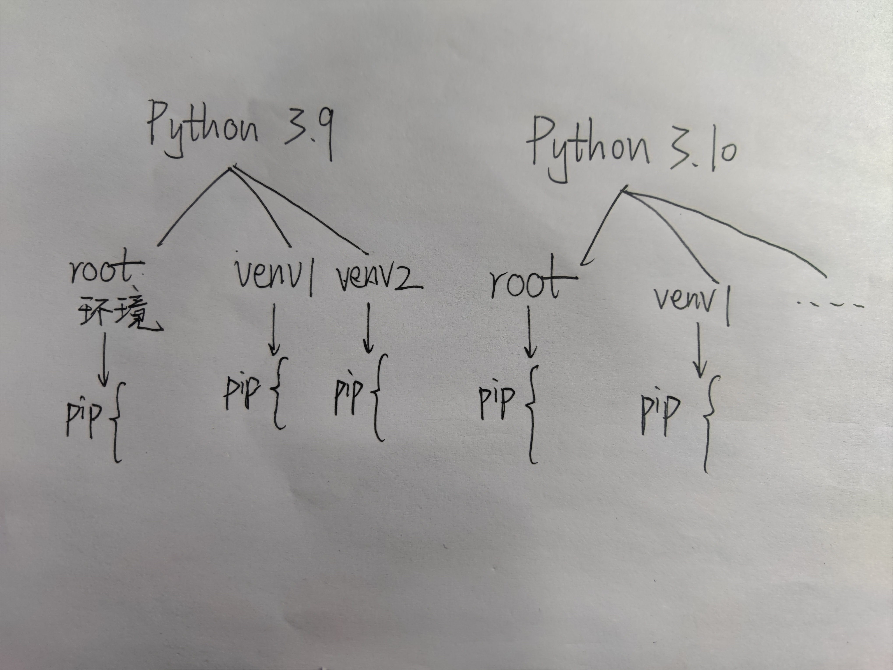

# 3.1 预备知识

## Python版本共存介绍：

以Python3.10.6为例，称3.10.*为一个Python大版本，*.6称为小版本。则Python的版本共存原则为

大版本可共存，小版本不可共存（安装必定报错）。

## Python虚拟环境结构：
我们使用原生的venv工具管理Python的虚拟环境

其它工具如Anaconda、Virtualenv都可以管理虚拟环境。

在安装Python3.4及以后时，会自动安装pip；在安装Python3.6及以后时，会自动安装venv。

综上，我们将Python虚拟环境结构示意如下。

各个大版本下的所有环境相互独立，各个环境下的pip库相互独立。

*2.1.1 结构图*

## 环境变量相关
我们一般直接在控制台输入的python, pip等指令，实际是一个“快捷指令”

原因在于安装Python时，已经将这些Python.exe/pip.exe的安装目录添加进了系统Path这一环境变量中。

在面临多版本的问题时，为了防止出错，我们可以手动指定这些文件的位置。其他使用方法和之前一样。

下一篇会详细提到。