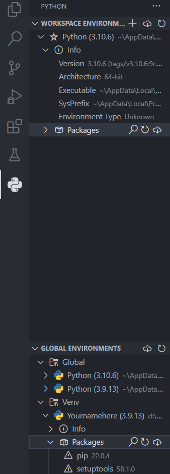

# Windows 配置虚拟环境

## Windows下常调用的目录

在Windows系统下涉及到多版本Python时，常常需要手动指定Python的位置，以下位置则尤为重要。

```
# 非虚拟环境下

# 以Python3.9为例

# Python默认安装位置

C:\Users\账户名\AppData\Local\Programs\Python\Python39\python.exe

# 根环境pip默认安装位置

C:\Users\账户名\AppData\Local\Programs\Python\Python39\Scripts\pip.exe
```

```
# 虚拟环境下

# Python位置
Yournamehere\Scripts\Python.exe
# pip位置
Yournamehere\Scripts\pip.exe
```

## 举个例子：在Windows上配置虚拟环境

在看接下来的内容时，注意账户名，python版本，环境名都需要自己修改。

代码的具体意义不再解释，可以自行GPT

1.建立环境

在上一级目录下打开终端（cmd或Powershell），执行以下命令

```
& "C:\Users\Steven Lin\AppData\Local\Programs\Python\Python39\python.exe" -m venv Yournamehere
```
终端实际显示
```
PS D:\Coding> & "C:\Users\Steven Lin\AppData\Local\Programs\Python\Python39\python.exe" -m venv Yournamehere
```
无输出内容，会在打开终端的目录创建一个名为Yournamehere的文件夹

2.检查环境

在.\Scripts目录下打开终端
```
输入：python
返回：系统环境变量中的Python
输入：.\python
返回：本虚拟环境中的Python版本
```
```
输入：pip list
返回：系统环境变量中所配置Python的根环境（根pip）内的第三方库
输入：.\pip list
返回：本虚拟环境第三方库（应该非常非常少）
```
**为了防止混淆，非常不建议在  外环境  安装虚拟环境库包**

3.启动环境（Windows版）

在.\Scripts目录下打开终端

```
输入: .\activate
返回：(Yournamehere) PS D:\Coding\Yournamehere\Scripts>
```
代表成功进入环境，前边的括号是虚拟环境名

4.安装第三方库

在虚拟环境内，使用指令安装第三方库

例如，Jupyter Notebook就可以在每个环境下分别安装

```
pip install 库名称==版本号
```

5.退出虚拟环境

在虚拟环境内，使用以下指令退出虚拟环境

```
deactivate
```

6.备注

在vscode中，可以使用Python Environment Manager来确认自己工作的路径，并使用切换运行具体文件的Python环境（版本）。


<center>*2.2.1 Python Environment Manager*</center>