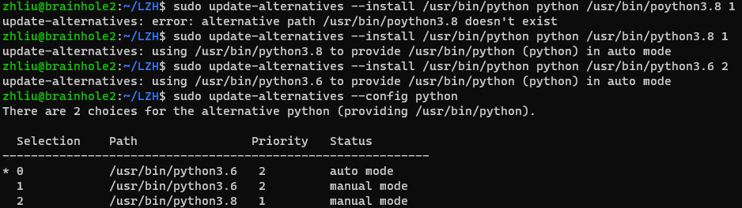

# 复现THU-DL-SR记录(Outdated)

Python

我们的系统为Ubuntu 20.04.6 LTS，自带Python3.8

使用指令安装Python3.6（可GPT）

配置Python优先级如下图


*image 2.2.1*

## CUDA

使用以下指令安装CUDA 自动选择的版本是V10.1.243

```
// sudo apt install nvidia-cuda-toolkit
```

## 虚拟环境

在以下位置建立虚拟环境

```
/home/ylin/DL-SR
```

建立虚拟环境的指令

```
// sudo python3 -m venv new_venv
（注意必须要写3）
```

Linux下启动虚拟环境方法：在以上目录执行以下指令

```
// source ./test_env/bin/activate
```

## 包：

requirements里面提供的包有问题，暂时现在本地推理

**清华包需要做出的一些修改**

修改1：Keras的import：需要将 from keras.layer.advanced_activations import ...改为from keras.layer

修改2：skimage的import：做以下修改

```
from skimage.metrics import structural_similarity as compare_ssim
from skimage.metrics import peak_signal_noise_ratio as compare_psnr
from skimage.metrics import mean_squared_error as compare_mse
from skimage.metrics import normalized_root_mse as compare_nrmse
替换原有的
#from skimage.measure import compare_mse, compare_nrmse, compare_psnr, compare_ssim
```

修改3：

```
#gpu_options = tf.GPUOptions(per_process_gpu_memory_fraction=gpu_memory_fraction)
#tf.Session(config=tf.ConfigProto(gpu_options=gpu_options))
gpu_options不需要了，直接注释掉
```

修改4：

pridict.py文件里的优化器重新定义如下

```
optimizer = tf.keras.optimizers.legacy.Adam(learning_rate=1e-5, decay=0.5)
```

修改5：

common.py文件里作以下修改

```
tf.ert
改为
tf.math.erf

tf.fft2d
改为
tf.signal.fft2d

tf.image.resize_images(output, (size_psc, size_psc), 0)
改为
tf.image.resize(output, (size_psc, size_psc), method='bilinear')

tf.depth_to_space
改为
tf.nn.depth_to_space
```