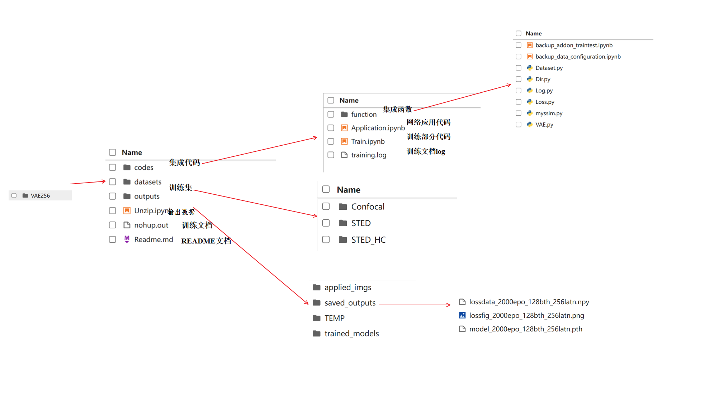
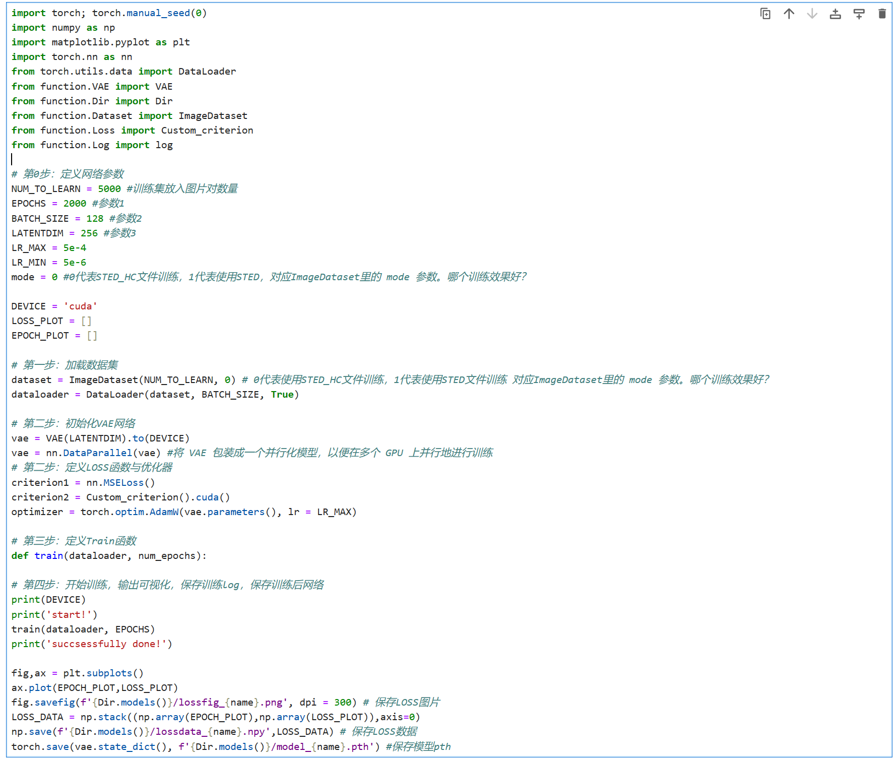

# VAE 程序结构

## 1 总架构

程序总架构如下：

*4.1.1 VAE程序总架构*

## 2 codes/Train.ipynb VAE网络训练过程解析

**这是网络训练过程的程序**

第0步：定义网络参数

第一步：加载训练集

第二步：初始化模型，定义LOSS函数与优化器

- 建立一个空白的VAE模型
- 定义LOSS函数
- 定义优化器

第三步：定义Train函数

第四步：开始训练，输出可视化，保存训练log，保存训练后网络

- 保存LOSS图片
- 保存LOSS数据
- 保存模型pth

*4.1.2 VAE网络训练过程*

## 3 codes/Application.ipynb 训练结果展示规范

定义一个训练结果展示的规范

**训练集还原结果**

**测试集还原结果**