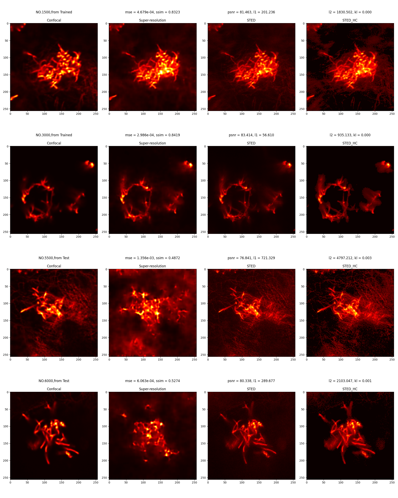
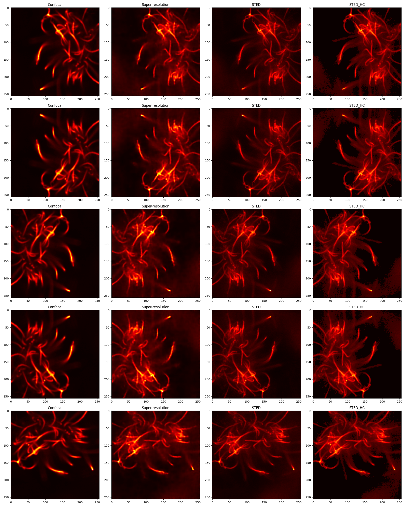
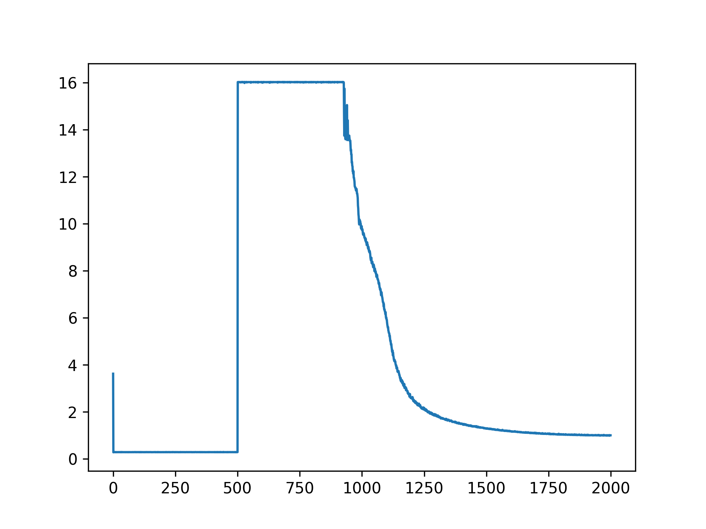
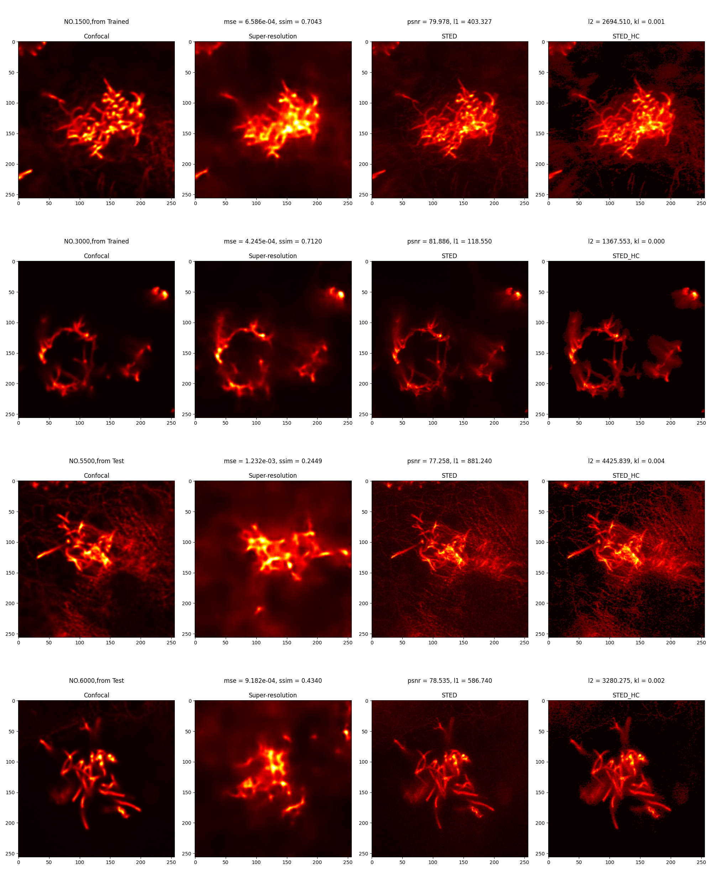
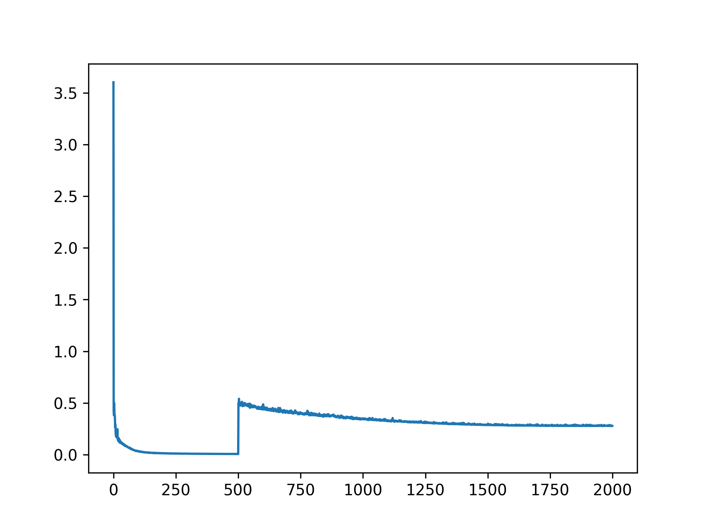
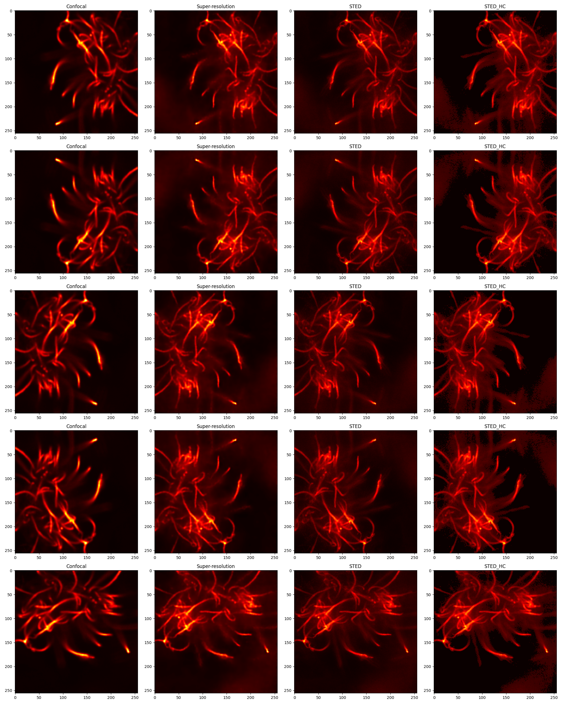

# VAE

## 网络结构

输入： 256 * 256 * 1

- Encoder： 3个卷积层+3个relu激活函数 -> 全连接层输出mu,logvar
- Decoder: 1个全连接层+3个反卷积层+2个relu函数 -> sigmoid保证输出在(0,1)
- VAE: 结合E和D，加入随机噪声进入平均. 在Forward中：首先将输入图像编码为潜在空间分布参数（均值和对数方差），然后使用重新参数化技巧从该分布中提取样本，最后将该样本解码回原始图像空间。

输出: 重建的图像，以及潜在空间分布的平均值和对数方差。

## 改进方向

### 从复杂度

#### 方向1 单独增加更多的卷积层

- 实验2_1 ：卷积层增加为4层

实验结果：

*EXP_2_1 实验结果*

修改1500为500后结果：

- 实验2_2 ：卷积层增加为7层 1024

训练时间：04/01/2024 04:55:51 PM - 04/02/2024 04:18:19 AM

实验结果：

- 实验2_3 ：卷积层增加为5层（1024）

训练时间：04/04/2024 12:08:56 AM - 04/04/2024 02:06:30 PM

实验结果：

**效果目前为止最好**

### 从过拟合

### 从神经网络多样性

引入残差块
