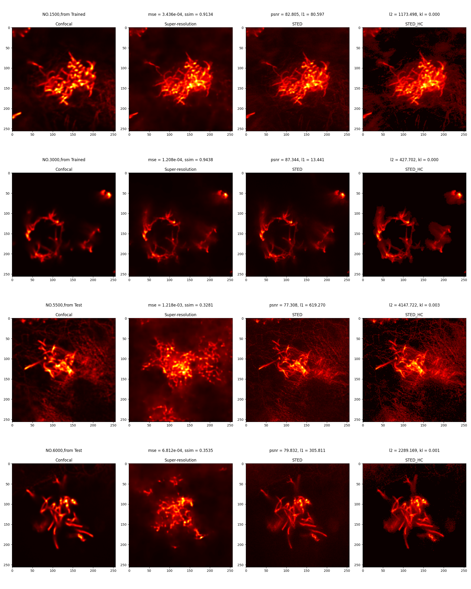

# VAE

## 网络结构

### 网络类型

该网络是一个变分自动编码器（VAE），包括一个编码器（Encoder）和一个解码器（Decoder）。编码器将输入数据编码为潜在空间中的分布参数（均值和方差），解码器将潜在空间的样本映射回原始数据空间。

### 输入尺寸

输入尺寸为 [batch_size, 1, 256, 256]，其中 batch_size 表示每个批次的样本数量，1 表示输入通道数，256 表示输入图像的高度和宽度。

### 节点变换

1.编码器（Encoder）部分：

- 5 个卷积层（conv1 到 conv5），每个卷积层之后都跟着 ReLU 激活函数。
- 在第 4 个卷积层之后，通过 view 操作将输出展平为一维张量。
- 最后通过两个全连接层（fc_mu 和 fc_logvar）将展平后的特征向量映射为潜在空间的均值和方差参数。

2.解码器（Decoder）部分：

- 一个全连接层将潜在变量映射回特征向量。
- 通过 view 操作将特征向量重塑为四维张量。
- 通过四个转置卷积层（conv5 到 conv2）进行逐步上采样，每个转置卷积层之后都跟着 ReLU 激活函数。
- 最后一个转置卷积层之后使用 Sigmoid 激活函数将输出限制在 [0, 1] 范围内。

### 节点参数

1.编码器（Encoder）部分：

- conv1: 输入通道数为 1，输出通道数为 4，卷积核大小为 3x3。
- conv2: 输入通道数为 4，输出通道数为 16，卷积核大小为 3x3。
- conv3: 输入通道数为 16，输出通道数为 64，卷积核大小为 3x3。
- conv4: 输入通道数为 64，输出通道数为 256，卷积核大小为 3x3。
- conv5: 输入通道数为 256，输出通道数为 1024，卷积核大小为 3x3。
- fc_mu 和 fc_logvar: 输入特征数量为 1024 * 8 * 8（最后一层卷积的输出大小），输出特征数量为潜在变量维度 latent_dim。

2.解码器（Decoder）部分：

- fc: 输入特征数量为潜在变量维度 latent_dim，输出特征数量为 1024 * 8 * 8。
- conv5 到 conv1: 转置卷积层的参数和编码器相对应，只是通道数相反，卷积核大小为 4x4。

### 激活函数

1. 编码器（Encoder）部分：使用 ReLU 激活函数。

2. 解码器（Decoder）部分：除了最后一层使用了 Sigmoid 激活函数外，其他层都使用 ReLU 激活函数。

## 改进方向

### 从复杂度

#### 方向1 单独增加更多的卷积层

- 实验2_1 ：卷积层增加为4层

实验结果：

*EXP_2_1 实验结果*

修改1500为500后结果：

- 实验2_2 ：卷积层增加为7层 1024

训练时间：04/01/2024 04:55:51 PM - 04/02/2024 04:18:19 AM

实验结果：

- 实验2_3 ：卷积层增加为5层（1024）

训练时间：04/04/2024 12:08:56 AM - 04/04/2024 02:06:30 PM

实验结果：

**效果目前为止最好**

### 从过拟合

### 从神经网络多样性

引入残差块
