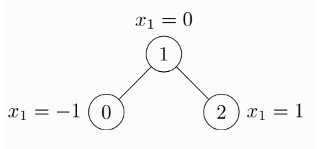

# 传统GNN方法

## GCN: 图卷积神经网络

[【GNN】万字长文带你入门 GCN](https://zhuanlan.zhihu.com/p/120311352)

## PYG: PyTorch Geometric Library

[图神经网络 PyG 入门介绍](https://blog.csdn.net/chumingqian/article/details/139416196)

官方文档：[PyG Documentation](https://pytorch-geometric.readthedocs.io/en/latest/index.html)

### 1 Data

节点和节点之间的边构成了图。所以在 PyG 中，如果你要构建图，那么需要两个要素：节点和边。PyG 提供了`torch_geometric.data.Data` (下面简称Data) 用于构建图，包括 5 个属性，每一个属性都不是必须的，可以为空。

- x: 用于存储每个节点的特征，形状是`[num_nodes, num_node_features]`。

- edge_index: 用于存储节点之间的边，形状是 `[2, num_edges]`。

- pos: 存储节点的坐标，形状是`[num_nodes, num_dimensions]`。

- y: 存储样本标签。如果是每个节点都有标签，那么形状是`[num_nodes, *]`；如果是整张图只有一个标签，那么形状是`[1, *]`。

- edge_attr: 存储边的特征。形状是`[num_edges, num_edge_features]`。

需要注意的的是，在`Data`里包含了样本的 label，这意味和 PyTorch 稍有不同。在PyTorch中，我们重写`Dataset`的`__getitem__()`，根据 index 返回对应的样本和 label。在 PyG 中，我们使用的不是这种写法，而是在`get()`函数中根据 index 返回`torch_geometric.data.Data`类型的数据，在`Data`里包含了数据和 label。

!!! note "Data 例子"
    一个数据创建的例子，一个未加权无向图 ( 未加权指边上没有权值 )，包括 3 个节点和 4 条边。

    

    由于是无向图，因此有 4 条边：(0 -> 1), (1 -> 0), (1 -> 2), (2 -> 1)。每个节点都有自己的特征。上面这个图可以使用`torch_geometric.data.Data`来表示如下：

    ```python linenums="1"
    import torch
    from torch_geometric.data import Data

    edge_index = torch.tensor([[0, 1, 1, 2],
                               [1, 0, 2, 1]], dtype=torch.long)
    x = torch.tensor([[-1], [0], [1]], dtype=torch.float)

    data = Data(x=x, edge_index=edge_index)
    ```

    注意`edge_index`中边的存储方式，有两个`list`，第 1 个`list`是边的起始点，第 2 个`list`是边的目标节点。注意与下面的存储方式的区别。

    ```python linenums="1"
    import torch
    from torch_geometric.data import Data

    edge_index = torch.tensor([[0, 1],
                               [1, 0],
                               [1, 2],
                               [2, 1]], dtype=torch.long)
    x = torch.tensor([[-1], [0], [1]], dtype=torch.float)

    data = Data(x=x, edge_index=edge_index.t().contiguous())
    ```
    这种情况edge_index需要先转置然后使用contiguous()方法。关于contiguous()函数的作用，查看 PyTorch中的[contiguous](https://zhuanlan.zhihu.com/p/64551412)。


!!! tip "Data 总结"
    Data中最基本的 4 个属性是x、edge_index、pos、y，我们一般都需要这 4 个参数。

!!!note "如何查看一个Data对象的属性: [Data](https://pytorch-geometric.readthedocs.io/en/latest/generated/torch_geometric.data.Data.html#torch_geometric.data.Data)"

    ```python linenums="1"
    print(data.keys())
    >>> ['x', 'edge_index']

    print(data['x'])
    >>> tensor([[-1.0],
                [0.0],
                [1.0]])

    for key, item in data:
        print(f'{key} found in data')
    >>> x found in data
    >>> edge_index found in data

    'edge_attr' in data
    >>> False

    data.num_nodes
    >>> 3

    data.num_edges
    >>> 4

    data.num_node_features
    >>> 1

    data.has_isolated_nodes()
    >>> False

    data.has_self_loops()
    >>> False

    data.is_directed()
    >>> False

    # Transfer data object to GPU.
    device = torch.device('cuda')
    data = data.to(device)
    ```


### 2 Dataset/DataLoader/transform

一个包含上述三个函数的例子：
```python linenums="1"
import torch_geometric.transforms as T
from torch_geometric.loader import DataLoader
from torch_geometric.datasets import ShapeNet

dataset = ShapeNet(root='/tmp/ShapeNet', categories=['Airplane'],
                    pre_transform=T.KNNGraph(k=6),
                    transform=T.RandomJitter(0.01))
loader = DataLoader(dataset, batch_size=32, shuffle=True)
```

#### 检查一个Dataset的参数

```python linenums="1"
from torch_geometric.datasets import TUDataset

dataset = TUDataset(root='/tmp/ENZYMES', name='ENZYMES')
>>> ENZYMES(600)

len(dataset)
>>> 600

dataset.num_classes
>>> 6

dataset.num_node_features
>>> 3

data = dataset[0]
>>> Data(edge_index=[2, 168], x=[37, 3], y=[1])  
# 有 168/2 = 84 条无向边，包含 37 个节点，每个节点有 3 个特征，图形只分配给一个类

data.is_undirected() # 是否为无向边
>>> True
```

## tarin.py 文档

### 导入库和定义辅助函数

首先，我们导入必要的库并定义辅助函数 networkx_to_pyg，用于将 NetworkX 图转换为 PyG 数据格式。

```python linenums="1"
import os
import pickle
import torch
import torch.nn.functional as F
from torch.optim import Adam
from torch_geometric.data import Data, Dataset, DataLoader
from torch_geometric.nn import GCNConv
import networkx as nx
import matplotlib.pyplot as plt

def networkx_to_pyg(G, labels):
    # 获取节点数
    num_nodes = G.number_of_nodes()

    # 创建节点映射：从字符串节点标识符到整数索引
    node_mapping = {node: i for i, node in enumerate(G.nodes())}

    # 获取边列表和边特征
    edges = G.edges(data=True)
    edge_index = []
    edge_attr = []

    for edge in edges:
        source, target, data = edge
        edge_index.append([node_mapping[source], node_mapping[target]])
        # 获取边的特征，比如 'value' 和 'timestamp'
        value = float(data['value'])
        timestamp = float(data['timestamp'])
        edge_attr.append([value, timestamp])

    # 转换为 PyG 的张量格式
    edge_index = torch.tensor(edge_index, dtype=torch.long).t().contiguous()
    edge_attr = torch.tensor(edge_attr, dtype=torch.float)

    # 获取节点标签
    y = torch.tensor([labels[node_mapping[node]] for node in G.nodes()], dtype=torch.float)

    # 计算每个节点的特征（假设为相连边特征的总和）
    x = torch.zeros((num_nodes, edge_attr.size(1)))
    for i, (source, target) in enumerate(edge_index.t().tolist()):
        x[source] += edge_attr[i]
        x[target] += edge_attr[i]

    data = Data(x=x, edge_index=edge_index, edge_attr=edge_attr, num_nodes=num_nodes, y=y)
    return data
```

- 导入库：导入必要的库，包括 PyTorch、PyG 和 Matplotlib。

- networkx_to_pyg 函数：该函数将 NetworkX 图转换为 PyG 数据格式，包含节点特征、边索引、边特征和节点标签。

### 自定义数据集类

我们定义了 MyGraphDataset 类，它继承自 PyG 的 Dataset 类，用于加载和处理图数据。

```python linenums="1"
class MyGraphDataset(Dataset):
    def __init__(self, root, label_root, transform=None, pre_transform=None):
        super(MyGraphDataset, self).__init__(root, transform, pre_transform)
        self.file_list = [f for f in os.listdir(root) if f.endswith('.pkl') and 'G_cluster1000' in f and int(f.split('_')[0]) <= 30]
        self.file_list.sort(key=lambda f: int(f.split('_')[0]))
        self.label_root = label_root
        self.label_list = [f'positive_{i+1}.pkl' for i in range(len(self.file_list))]

    def len(self):
        return len(self.file_list)

    def get(self, idx):
        file_path = os.path.join(self.root, self.file_list[idx])
        label_file_path = os.path.join(self.label_root, self.label_list[idx])

        with open(file_path, 'rb') as f:
            G = pickle.load(f)

        with open(label_file_path, 'rb') as f:
            labels = pickle.load(f)

        data = networkx_to_pyg(G, labels)
        return data
```

- 初始化：在初始化方法中，加载图文件和对应的标签文件，并排序。

- len 方法：返回数据集的大小。

- get 方法：根据索引加载图和标签文件，并调用 networkx_to_pyg 函数将其转换为 PyG 数据格式。

### 定义图卷积网络模型

```python linenums="1"
class GCN(torch.nn.Module):
    def __init__(self, in_channels, hidden_channels, out_channels):
        super(GCN, self).__init__()
        self.conv1 = GCNConv(in_channels, hidden_channels)
        self.conv2 = GCNConv(hidden_channels, out_channels)

    def forward(self, data):
        x, edge_index = data.x, data.edge_index
        x = self.conv1(x, edge_index)
        x = F.relu(x)
        x = self.conv2(x, edge_index)
        return F.log_softmax(x, dim=1)
```

- 初始化：定义两层图卷积层，分别从输入维度到隐藏层维度，再到输出维度。

- 前向传播：定义前向传播过程，包含两层图卷积和一个 ReLU 激活函数，最后输出经过 softmax 的概率分布。

### 定义训练函数

```python linenums="1"
def train(model, data_loader, device, optimizer, criterion):
    model.train()
    epoch_loss = 0
    for data in data_loader:
        data = data.to(device)
        optimizer.zero_grad()
        out = model(data)  # 前向传播
        loss = criterion(out, data.y.long())  # 计算损失
        loss.backward()  # 反向传播
        optimizer.step()  # 更新参数
        epoch_loss += loss.item()
    return epoch_loss / len(data_loader)
```

- 训练模式：将模型设置为训练模式。

- 损失初始化：初始化每个 epoch 的损失。

- 数据加载和前向传播：将数据加载到设备（GPU），进行前向传播计算输出。

- 计算和反向传播损失：计算损失并进行反向传播，更新模型参数。

- 返回平均损失：返回每个 epoch 的平均损失。

### 训练和保存模型

```python linenums="1"
# 创建Dataset实例
dataset = MyGraphDataset(root='/root/autodl-tmp/clustering', label_root='/root/autodl-tmp/positive')

# 创建DataLoader
dataloader = DataLoader(dataset, batch_size=1, shuffle=True)

# 将模型和数据移动到 GPU（如果可用）
device = torch.device('cuda' if torch.cuda.is_available() else 'cpu')
model = GCN(in_channels=2, hidden_channels=16, out_channels=2).to(device)  # 假设有2个类别

# 定义优化器和损失函数
optimizer = Adam(model.parameters(), lr=0.01)
criterion = torch.nn.CrossEntropyLoss()

# 记录每个 epoch 的损失
losses = []

# 训练模型
num_epochs = 200
for epoch in range(num_epochs):
    epoch_loss = train(model, dataloader, device, optimizer, criterion)
    losses.append(epoch_loss)
    print(f'Epoch {epoch + 1}/{num_epochs}, Loss: {epoch_loss}')

# 保存模型
torch.save(model.state_dict(), 'gcn_model.pth')
print('Model saved to gcn_model.pth')

# 绘制损失图像
plt.figure()
plt.plot(range(1, num_epochs + 1), losses, label='Training Loss')
plt.xlabel('Epoch')
plt.ylabel('Loss')
plt.title('Training Loss over Epochs')
plt.legend()
plt.savefig('training_loss.png')
print('Training loss plot saved to training_loss.png')

# 展示dataloader第一个划分里的数据
for i, data in enumerate(dataloader):
    if i == 0:
        print(data)
        print("Edge Index:")
        print(data.edge_index)
        print("Edge Attributes:")
        print(data.edge_attr)
        print("Node Labels:")
        for j, label in enumerate(data.y):
            print(f"Node {j}: Label = {label.item()}")
        break
```

- 数据集和数据加载器：创建数据集和数据加载器实例。

- 设备设置：设置设备为 GPU（如果可用）。

- 模型定义：定义 GCN 模型，假设输入有 2 个特征，输出有 2 个类别。

- 优化器和损失函数：定义 Adam 优化器和交叉熵损失函数。

- 训练模型：训练模型 200 个 epoch，并记录每个 epoch 的损失。

- 保存模型：训练结束后，保存模型的状态字典。

- 绘制和保存损失图像：绘制训练过程中损失的变化，并保存为 PNG 文件。

- 展示数据：展示数据加载器中第一个划分的数据，包括边索引、边特征和节点标签。