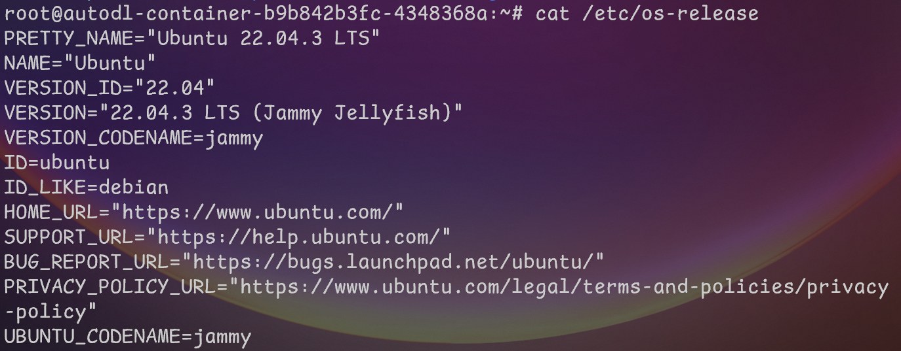
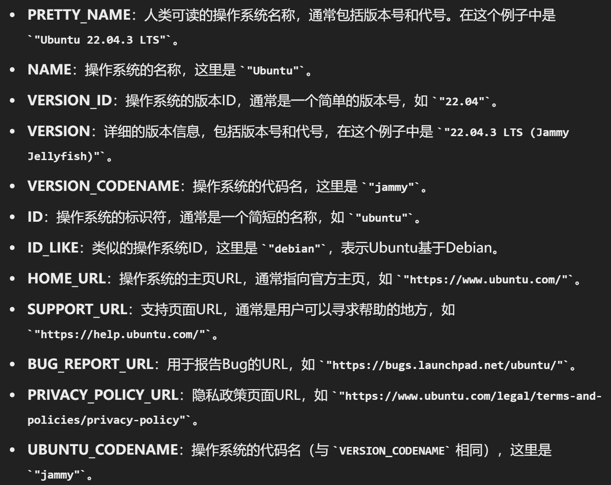

# 服务器操作笔记

## 开始

!!!note
    `free -h` : 查看磁盘使用情况  
    `df -h`: 查看系统盘、硬盘容量  
    `nvidia-smi`  

    `python --version` ：检查python版本  
    `python -c "import torch; print(torch.__version__)"` : 检查pytorch版本  
    `nvcc --version` : 检查cuda版本

### 0 一般操作

- ssh连接服务器

```
ssh -L 8889:localhost:8889 root@111.61.30.143
```

使用vscode进行服务器编辑：[https://blog.csdn.net/kiong_/article/details/135877723](https://blog.csdn.net/kiong_/article/details/135877723)

vscode连接服务器使用ipynb文件的小问题：[vscode中 ssh连接服务器后 无法为jupyter文件选择内核kernel](https://blog.csdn.net/jyk19991222/article/details/131486776)

- 配置查看

1.基本系统信息

`cat /etc/os-release`





`uname -r` :用于显示当前操作系统使用的内核版本

2.CPU信息

`lscpu` :  命令用于显示详细的CPU架构信息，包括CPU型号、核心数、线程数等。

3.内存信息：

`free -h` : 查看磁盘使用情况

4.磁盘信息：

`lsblk` : 查看分区信息

`df -h`: 查看系统盘、硬盘容量

5.显卡信息：

`nvidia-smi`


### 1 账户隐藏文件

用 `ls -a`查看所有文件：

```
.   .bash_history  .bashrc  .config             .ipython  .local    .python_history  .sudo_as_admin_successful
..  .bash_logout   .cache   .ipynb_checkpoints  .jupyter  .profile  snap             .viminfo
```

- . 当前文件
- .. 上一级文件
- .bash_history: 这个文件包含了用户在命令行中执行的历史命令记录。每次用户退出登录时，这个文件会被更新。
- .bash_logout: 当用户退出 Bash shell 时，会执行这个文件中的命令。通常用于清理临时文件或执行其他清理任务。
- **.bashrc: 这是 `Bash shell` 的配置文件，用于设置用户的个性化命令别名、环境变量以及其他 Bash shell 的行为。**
- .cache: 这个目录用于存储应用程序的缓存文件。缓存文件可以提高应用程序的性能，但有时也可能占用大量磁盘空间。
- **.config: 这个目录通常用于存储用户的应用程序配置文件。许多应用程序会在这个目录下创建子目录来存储它们的配置信息。**
- .ipython: 这个目录包含了 IPython（一个交互式 Python shell）的配置文件和历史记录。
- .ipynb_checkpoints: 这个目录是 Jupyter Notebook 自动生成的，用于存储 notebook 文件的检查点版本。这些检查点版本可以用于恢复 notebook 文件的先前状态。
- **.jupyter: 这个目录包含了 Jupyter Notebook 的配置文件和相关数据，例如自定义的笔记本模板和扩展。**
- .local: 这个目录通常用于存储用户的本地安装的程序和数据。例如，用户可以将 Python 包安装到这个目录中，而不是系统范围内安装。
- .profile: 这是用户登录时执行的 Bourne shell 配置文件。它类似于 .bashrc，但适用于 Bourne shell 及其衍生版本，如 Bash。
- snap: 这个目录包含了通过 Snap 包管理器安装的应用程序。Snap 是一种打包和分发 Linux 应用程序的方法，它将应用程序和它们的依赖项捆绑在一起。
- .python_history: 这个文件包含了用户在 Python shell 中执行的历史命令记录，类似于 .bash_history。
- .sudo_as_admin_successful: 这个文件是 sudo 命令生成的，表示上次使用 sudo 命令时身份验证成功。

### 2 文件读写权限：Permission denied

跨账户操作时常遇到。在一个账户时无法打开另一个账户的文件：

```
ylin1@zhliu-X10DRi:~$ cd /home/zhliu
-bash: cd: /home/zhliu: Permission denied
```

解决方法 1 ：使用sudo 命令

```
sudo + 命令
```

解决方法 2 ：使用root身份操作

```
#进入root管理员身份：
sudo -i
#退出root管理员身份：
exit
```

复制文件夹时，常常会遇到权限问题，使用以下代码改变文件夹所有者

```
sudo chown -R ylin1:ylin1 trained_models
```

### 3 账户相关

```
# 查看服务器有哪些账户
getent passwd

# 查看当前账户是否具有root权限
sudo -l

# 查看某用户的所有权限
groups username

# 创建账户
sudo adduser newuser

# 给某用户sudo权限
sudo adduser username sudo
```

### 4 后台管理

后台运行ipynb文件：

```
nohup runipy ./codes/Train.ipynb 2>&1 &
```

查看后台、查看指定后台、停止后台

注：ps aux 中 Time 的单位是小时（ 7:23 表示 7h23min）

```
# 查看所有后台
ps aux 

# 查看指定用户后台
ps aux | grep username

# 查看 runipy 字符串后台
ps aux | grep runipy

# 停止某个后台
kill PID
```


### 5 系统环境变量 多账户未添加

pip安装相关包时出现：

```
WARNING: The script lit is installed in '/home/zywang/.local/bin' which is not on PATH.
```

并且运行一些命令会找不到。如：`jupyter notebook` ，报错：

```
Jupyter command `jupyter-notebook` not found.
```

解决方法：

1.将当前路径放入系统环境变量中

```
echo 'export PATH="$HOME/.local/bin:$PATH"' >> ~/.bashrc
```

2.应用环境变量

```
source ~/.bashrc
```

### 6 配置网络

1、主要网口："2: enp4s0f0"，打开就可以访问教育网。除lo网口（loop回环）外，网口均为自动获取ip地址。
2、访问教育网外网方法：

```
# 进入root账户
sudo -i
# 切换到脚本目录
cd /home/jzhang/bin
# 以文本编辑器打开login文件（没有后缀名）
nano login
# 写入以下内容
curl -X POST https://p.nju.edu.cn/api/portal/v1/login -H "Content-type: application/json" -d '{"username":"统一验证账号","password":"统一验证密码"}'
# Ctrl+W写入Ctrl+X关闭，运行脚本
run ./login
```
## 数据

### 1 上传数据

1. 公网网盘，直接使用阿里云盘、百度网盘上传下载数据，强烈推荐
- JupyterLab上传，和网盘类似，优点简单，但是只支持文件不支持文件夹
- scp命令支持文件和文件夹上传下载，命令行执行
- FileZilla软件支持文件和文件夹，拖拉拽即可上传下载，推荐使用
- XShell软件支持管理SSH连接，而且集成了xftp，支持拖拉拽上传下载文件夹/文件，推荐使用

### 2 下载数据

1. JupyterLab可以下载文件，但是不能下载文件夹，好处是简单易用
- 公网网盘(强烈推荐)，直接使用阿里云盘、百度网盘上传下载数据
- scp命令支持文件和文件夹，由于是命令行执行，上手难度稍高
- FileZilla软件支持文件和文件夹，拖拉拽即可上传下载，推荐使用

## 环境配置-anaconda

### 1 安装anaconda

- x86架构

`uname -a` 查看架构类型

下载压缩包：

```
wget https://repo.anaconda.com/archive/Anaconda3-2021.11-Linux-x86_64.sh
```

解压：

```
bash Anaconda3-2021.11-Linux-x86_64.sh -b -p /fsa/home/ww_liuzh/anaconda
```

- aarch64架构（华为服务器）

```
wget -c https://repo.anaconda.com/archive/Anaconda3-2021.05-Linux-aarch64.sh
```

### 2 设置到系统环境变量

打开.bashrc，并添加路径到环境变量

```
vim .bashrc

# 添加：
export PATH="/fsa/home/ww_liuzh/anaconda/bin:$PATH"

# 激活：（我老是忘记）
source ~/.bashrc
```

### 3 创建虚拟环境

```bash
# 创建（自动继承base所有包）
conda create -n env_name python=3.10.14
# 创建（不继承任何包）
conda create --name env_name python=3.6.8 --no-default-packages
# 激活
conda activate env_name
# 退出
conda deactivate
# 列出环境
conda list
# 删掉环境
conda env remove -n env_name
# 创建环境文件（conda版，pip同样使用。实际上，pip也一样）
conda env export > environment.yml
# 还原环境
conda env create -f environment.yml
```

### 4 在jupyter notebook中引用虚拟环境

添加某个虚拟环境到Kernel，见：

[https://zhuanlan.zhihu.com/p/160997771](https://zhuanlan.zhihu.com/p/160997771)

1. 进入虚拟环境（重要）
2. 安装ipykernel  
```
#conda安装
conda install -c anaconda ipykernel
# pip安装方法
pip install ipykernel
```
3. 在ipykernel中添加虚拟环境名称，--name后面对应设置的环境名称  
```
python -m ipykernel install --user --name=my_env
```
>> 附：**ipykernel相关操作**  
>> 1. 列出已安装的kernel:  `jupyter kernelspec list`，附带每个kernel所在路径  
>> 2. 查看制定kernel路径: `jupyter kernelspec list | grep my_env`

## DOCKER

### 1 应用场景

使用Docker在轻量应用服务器上搭建应用服务，例如：

- 搭建个人博客或网站，使用Docker可以快速部署Web应用程序，并确保每个环境的一致性。

- 构建开发环境，Docker可以轻松地为每个项目创建一个隔离的环境，确保开发工具和依赖项的一致性。

- 部署数据库服务，例如MySQL、PostgreSQL等，Docker可以简化数据库的安装和配置过程。

### 2 操作

`docker ps`：查看正在运行的容器。  
`docker start/stop`：启动或停止容器。  
`docker rm`：删除容器。  
`docker logs`：查看容器的日志。  
`docker exec`：在容器内执行命令。  