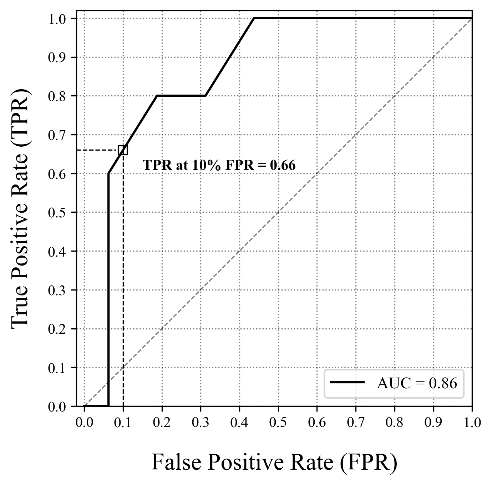
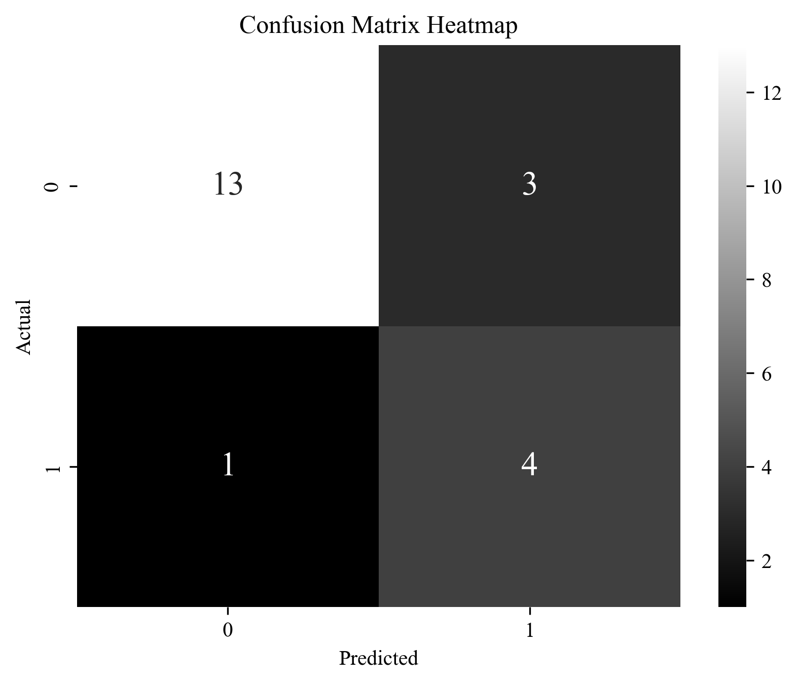

# 单专家模型

## 单专家模型——Llama3预测 第一次调整

1. 基座模型：使用英文基座模型。**需要将微调数据集改为英文。**

2. 数据问题：  
    数据重叠的问题  
    阅读以太坊钓鱼节点检测论文  
    **最原始数据重新处理**

3. 方法：微调为主，提示工程为辅

4. 可能会用到的突破窗口长度：`Long context window` 技巧  
    显存问题（不用重新训练）  
    正确率问题

5. GCN 问题： 寻找PYG现有的案例，尽量迁移

## 第二次调整

1. 原始数据问题

    - 理论上预测者（警察）拥有所有的历史数据

    - 编号问题：没有全局统一编号，只能1、2、3往下依次编号

    - **划分问题：回看最新一个月的数据，老节点无新交易不做预测，老节点新交易做预测，预测新节点（可能不是最优）**

    - 标签问题：（1）标签来源于哪里？ - 原始数据包含标签；两种策略：下一步的训练依赖估计/不依赖估计

2. 传统模型 GCN

    - 应用场景：用过去一个月的数据，预测这个月的节点。

    - 技术运用：GCN（将一个节点的所有数据生成一个融合的属性）+latgpn

    - 问题：样本不均衡（大模型可改善）

3. 基本问题

    - 时间区域：2017.8 - 2021.10

## 单专家模型——Gpt4预测——第一划分_10结点训练集_20结点测试小实验
### DataGeneration

可优化点：

- 只选取`1_graph_10000_data_Networkit.pkl`，训练集轻量

- 只选取 10 个结点作为训练集

示例：

```
诈骗节点交易信息：

节点 3 交易记录:
在2017-07-14 23:39:04, 与节点 1 交易 2.0 比特币
在2017-07-12 04:21:00, 与节点 2 交易 17.027209 比特币
在2017-07-04 00:03:42, 与节点 4 交易 29.9999 比特币
在2017-06-25 03:32:29, 与节点 5 交易 0.157 比特币
在2017-06-15 07:08:08, 与节点 6 交易 1.18471303 比特币
在2017-07-09 04:06:16, 与节点 8 交易 0.4170490559191968 比特币
在2017-07-09 13:25:29, 与节点 9 交易 0.06792073 比特币
在2017-07-13 23:01:58, 与节点 11 交易 1.53 比特币
在2017-07-05 02:18:54, 与节点 13 交易 0.03648798 比特币
在2017-07-13 04:31:12, 与节点 14 交易 0.13667291 比特币
在2017-07-13 09:13:45, 与节点 15 交易 0.098 比特币
在2017-07-10 04:57:14, 与节点 16 交易 0.13386637 比特币
在2017-06-17 21:31:43, 与节点 17 交易 0.001806355147400908 比特币
在2017-07-14 23:23:58, 与节点 18 交易 1.0 比特币
在2017-07-07 16:57:41, 与节点 19 交易 2.94376895 比特币
在2017-06-11 22:11:22, 与节点 20 交易 0.33069394 比特币
在2017-06-29 19:59:48, 与节点 21 交易 0.01371988 比特币
在2017-07-06 04:46:40, 与节点 22 交易 5.27 比特币
在2017-07-14 23:48:41, 与节点 23 交易 24.54510793 比特币
在2017-07-07 11:46:40, 与节点 24 交易 16.0 比特币
在2017-07-03 08:15:42, 与节点 25 交易 117.06885305 比特币
在2017-07-14 20:17:44, 与节点 26 交易 0.93889065 比特币
在2017-07-04 08:46:38, 与节点 27 交易 37.0 比特币
在2017-07-14 15:08:33, 与节点 28 交易 2.71439787 比特币
在2017-07-14 10:45:28, 与节点 29 交易 1.8 比特币
在2017-07-07 18:02:28, 与节点 30 交易 0.39785 比特币
在2017-07-14 04:49:34, 与节点 31 交易 0.1841254 比特币
在2017-07-13 06:57:29, 与节点 33 交易 1.05 比特币
在2017-07-13 07:56:48, 与节点 35 交易 19.99958 比特币
在2017-05-25 20:07:04, 与节点 36 交易 516.79586563 比特币
在2017-06-29 16:01:52, 与节点 37 交易 3.47631286 比特币
在2017-06-27 19:08:42, 与节点 38 交易 9.269 比特币
在2017-06-27 05:12:46, 与节点 42 交易 9.90217957 比特币
在2017-06-19 21:42:50, 与节点 46 交易 5.335454 比特币
在2017-06-23 13:41:27, 与节点 48 交易 0.81 比特币
在2017-06-27 08:40:50, 与节点 51 交易 2.84029467 比特币
在2017-07-14 10:27:09, 与节点 52 交易 0.065 比特币
在2017-06-24 23:36:14, 与节点 55 交易 0.15198851 比特币
在2017-07-03 02:25:15, 与节点 87 交易 0.080622 比特币
打分：100

节点 9 交易记录:
在2017-07-09 13:25:29, 与节点 3 交易 0.06792073 比特币
在2017-05-26 03:00:53, 与节点 4 交易 2.0 比特币
在2017-05-26 20:00:50, 与节点 5 交易 1.071 比特币
在2017-07-13 19:42:37, 与节点 6 交易 0.09958 比特币
在2017-06-12 23:02:57, 与节点 8 交易 0.1 比特币
在2017-07-06 00:22:08, 与节点 13 交易 1.91075488 比特币
在2017-06-27 00:43:21, 与节点 14 交易 0.24567583 比特币
在2017-07-03 08:08:13, 与节点 16 交易 0.43258 比特币
在2017-06-14 10:39:56, 与节点 17 交易 0.16573209348194679 比特币
在2017-07-14 21:03:22, 与节点 18 交易 19.959000019999998 比特币
在2017-07-12 03:41:25, 与节点 19 交易 2.97236886 比特币
在2017-07-12 22:02:08, 与节点 22 交易 1.60001964 比特币
在2017-06-29 16:01:03, 与节点 28 交易 0.34981433 比特币
在2017-06-22 06:00:20, 与节点 29 交易 1.71 比特币
在2017-06-29 19:40:19, 与节点 31 交易 0.01 比特币
在2017-07-13 19:12:55, 与节点 35 交易 1.5 比特币
在2017-07-12 05:22:17, 与节点 37 交易 0.89085106 比特币
在2017-07-02 03:25:29, 与节点 38 交易 10.0 比特币
在2017-06-25 20:19:07, 与节点 42 交易 1.0043522 比特币
在2017-06-24 09:15:38, 与节点 48 交易 1.0 比特币
打分：100

节点 13 交易记录:
在2017-07-05 02:18:54, 与节点 3 交易 0.03648798 比特币
在2017-07-07 00:54:35, 与节点 4 交易 0.50460488 比特币
在2017-07-13 00:16:57, 与节点 6 交易 26.0 比特币
在2017-06-15 08:35:02, 与节点 8 交易 1.5 比特币
在2017-07-06 00:22:08, 与节点 9 交易 1.91075488 比特币
在2017-07-13 00:58:04, 与节点 11 交易 0.162033974 比特币
在2017-07-03 17:17:10, 与节点 12 交易 10.42675563 比特币
在2017-07-07 14:18:07, 与节点 14 交易 5.78153798 比特币
在2017-07-13 00:41:38, 与节点 16 交易 0.08412178 比特币
在2017-06-04 17:19:42, 与节点 17 交易 0.05 比特币
在2017-07-14 22:20:02, 与节点 18 交易 1.0 比特币
在2017-07-14 18:32:27, 与节点 19 交易 24.499537980000003 比特币
在2017-07-06 19:53:04, 与节点 20 交易 1.81251488 比特币
在2017-07-11 15:39:20, 与节点 22 交易 7.63925183 比特币
在2017-07-05 03:49:45, 与节点 23 交易 2.23739 比特币
在2017-07-05 22:39:38, 与节点 24 交易 0.97953798 比特币
在2017-07-08 15:14:34, 与节点 25 交易 3.0 比特币
在2017-07-03 19:41:18, 与节点 26 交易 0.66366673 比特币
在2017-07-14 10:33:34, 与节点 27 交易 25.29877 比特币
在2017-07-08 03:00:27, 与节点 28 交易 9.982906 比特币
在2017-07-14 12:19:33, 与节点 29 交易 0.01138 比特币
在2017-07-12 21:56:44, 与节点 30 交易 2.497562 比特币
在2017-07-06 06:25:11, 与节点 31 交易 3.38283 比特币
在2017-07-02 09:46:20, 与节点 33 交易 11.43947 比特币
在2017-07-06 13:45:41, 与节点 35 交易 1.90713 比特币
在2017-07-04 11:39:25, 与节点 36 交易 9.01662 比特币
在2017-07-04 13:07:12, 与节点 40 交易 1.76 比特币
在2017-06-13 00:17:31, 与节点 42 交易 17.0 比特币
在2017-07-14 15:00:24, 与节点 44 交易 1.93010421 比特币
在2017-07-11 14:32:01, 与节点 48 交易 25.88653 比特币
在2017-07-14 21:54:37, 与节点 51 交易 74.741 比特币
在2017-06-23 19:18:17, 与节点 55 交易 6.133 比特币
打分：100

正常节点交易信息：

节点 14 交易记录:
在2017-07-14 21:28:52, 与节点 1 交易 0.02667921 比特币
在2017-07-13 04:31:12, 与节点 3 交易 0.13667291 比特币
在2017-05-30 20:42:44, 与节点 4 交易 1.46289249 比特币
在2017-06-27 00:43:21, 与节点 9 交易 0.24567583 比特币
在2017-07-14 21:23:30, 与节点 11 交易 0.05110798 比特币
在2017-07-07 14:18:07, 与节点 13 交易 5.78153798 比特币
在2017-07-12 12:30:41, 与节点 15 交易 0.5421896219540601 比特币
在2017-05-26 21:57:28, 与节点 16 交易 0.38577897 比特币
在2017-06-17 21:10:51, 与节点 17 交易 0.042019268965 比特币
在2017-07-03 13:13:30, 与节点 20 交易 2.32001995 比特币
在2017-07-11 14:43:37, 与节点 22 交易 0.51777518 比特币
在2017-06-22 22:34:29, 与节点 24 交易 0.07 比特币
在2017-07-07 21:50:15, 与节点 25 交易 2.0 比特币
在2017-07-09 09:58:31, 与节点 26 交易 0.02 比特币
在2017-06-06 14:54:27, 与节点 27 交易 0.089337412000042 比特币
在2017-07-07 10:16:03, 与节点 28 交易 0.31779661 比特币
在2017-07-04 04:03:11, 与节点 31 交易 0.928684915 比特币
在2017-07-07 11:46:47, 与节点 33 交易 0.5 比特币
在2017-07-13 17:27:47, 与节点 35 交易 2.35 比特币
在2017-06-26 01:51:30, 与节点 37 交易 0.17383929 比特币
在2017-07-10 19:28:01, 与节点 46 交易 24.9 比特币
在2017-06-05 01:22:06, 与节点 55 交易 24.30314317 比特币
打分：0

节点 17 交易记录:
在2017-07-04 06:10:33, 与节点 1 交易 0.003 比特币
在2017-06-17 21:31:43, 与节点 3 交易 0.001806355147400908 比特币
在2017-06-18 17:54:20, 与节点 4 交易 0.0020946558 比特币
在2017-06-13 04:25:56, 与节点 5 交易 0.003401504294 比特币
在2017-05-27 13:20:29, 与节点 6 交易 5.30704 比特币
在2017-06-11 05:42:00, 与节点 8 交易 0.0253616049359179 比特币
在2017-06-14 10:39:56, 与节点 9 交易 0.16573209348194679 比特币
在2017-06-10 06:22:37, 与节点 12 交易 0.013793496267 比特币
在2017-06-04 17:19:42, 与节点 13 交易 0.05 比特币
在2017-06-17 21:10:51, 与节点 14 交易 0.042019268965 比特币
在2017-06-25 13:21:12, 与节点 15 交易 1.0 比特币
在2017-06-16 20:25:18, 与节点 16 交易 2.0 比特币
在2017-07-14 21:36:34, 与节点 18 交易 0.111 比特币
在2017-06-16 22:42:49, 与节点 19 交易 0.518902552213 比特币
在2017-07-05 21:08:53, 与节点 22 交易 0.1 比特币
在2017-06-10 01:41:15, 与节点 25 交易 0.002389024 比特币
在2017-05-31 12:50:51, 与节点 27 交易 0.01 比特币
在2017-07-12 10:29:53, 与节点 28 交易 0.11996449 比特币
在2017-05-24 17:31:45, 与节点 30 交易 2.0 比特币
在2017-06-18 05:01:52, 与节点 31 交易 0.003163150152 比特币
在2017-06-07 06:00:58, 与节点 32 交易 0.07117095840255763 比特币
在2017-06-09 08:25:26, 与节点 33 交易 0.995 比特币
在2017-06-29 21:09:54, 与节点 35 交易 1.0 比特币
在2017-06-28 15:45:56, 与节点 37 交易 4.09864433 比特币
在2017-07-02 12:11:12, 与节点 38 交易 1.0 比特币
在2017-06-12 23:32:05, 与节点 42 交易 1.038 比特币
在2017-06-13 16:07:49, 与节点 48 交易 0.07611869227814867 比特币
在2017-06-22 14:45:12, 与节点 55 交易 0.29260663767303124 比特币
打分：0

节点 22 交易记录:
在2017-07-13 01:18:38, 与节点 1 交易 3.0 比特币
在2017-07-06 04:46:40, 与节点 3 交易 5.27 比特币
在2017-07-14 11:19:33, 与节点 6 交易 0.32054093 比特币
在2017-07-04 11:55:32, 与节点 8 交易 0.98600799 比特币
在2017-07-12 22:02:08, 与节点 9 交易 1.60001964 比特币
在2017-07-14 23:02:05, 与节点 12 交易 1.255278 比特币
在2017-07-11 15:39:20, 与节点 13 交易 7.63925183 比特币
在2017-07-11 14:43:37, 与节点 14 交易 0.51777518 比特币
在2017-07-14 01:23:12, 与节点 15 交易 0.13 比特币
在2017-07-05 21:08:53, 与节点 17 交易 0.1 比特币
在2017-07-12 23:24:53, 与节点 18 交易 7.68116837 比特币
在2017-07-04 12:13:35, 与节点 19 交易 0.5 比特币
在2017-07-10 07:52:12, 与节点 20 交易 0.15041831 比特币
在2017-07-10 20:02:11, 与节点 21 交易 1.0 比特币
在2017-07-13 23:09:25, 与节点 23 交易 0.21 比特币
在2017-07-14 14:21:32, 与节点 24 交易 0.2495 比特币
在2017-07-06 09:22:38, 与节点 25 交易 0.5 比特币
在2017-07-14 07:24:04, 与节点 26 交易 0.41901514 比特币
在2017-07-14 15:08:33, 与节点 28 交易 2.4996027 比特币
在2017-07-12 06:37:07, 与节点 29 交易 0.1 比特币
在2017-07-14 16:39:17, 与节点 32 交易 3.23791215 比特币
在2017-07-02 09:58:26, 与节点 37 交易 0.194296 比特币
在2017-07-08 02:41:41, 与节点 38 交易 16.0 比特币
在2017-06-12 23:23:29, 与节点 42 交易 1.74 比特币
在2017-07-06 05:01:49, 与节点 46 交易 1.0 比特币
打分：0
```

### SingleExpertModle

- 可优化点：

训练集大小、人设和人物设定


- 角色设定

```
messages_system_A = f"""你是一个智能的金融分析师，具备深入理解和分析交易数据的能力，受聘于一家金融公司，任务是根据提供的以太坊交易数据来识别欺诈交易节点。
"""
```

- 任务设定

```
message_A = f"""
节点类别有两类，分别是0和1；类别标签为1的是欺诈账户节点；类别标签为0的是正常账户节点。你需要利用交易数据，进行交易节点的准确预测。请从专业的角度出发，考虑以下几个方面：
1.从交易时间上，正常节点和诈骗节点分别有什么特征？
2.从交易金额上，正常节点和诈骗节点分别有什么特征？
3.从交易对象上，正常节点和诈骗节点分别有什么特征？
4.正常节点与欺诈节点的差异
"""
```

- 评分标准

```
message_rule = f"""
请根据以下的评分标准为您的判断进行打分：
诈骗节点可能性评分表
0： 这个结点的交易信息满足正常人的交易账户信息，没有一点异常，不可能是诈骗结点
1-10： 非常低，该节点极不可能是诈骗节点。
11-20： 很低，该节点的诈骗可能性非常低。
21-40： 较低，该节点的诈骗可能性比较低。
41-60： 一般，该节点的诈骗可能性一般。
61-80： 较高，该节点的诈骗可能性比较高。
81-90： 非常高，该节点的诈骗可能性很高。
91-99： 极高，该节点极有可能是诈骗节点。
100： 该节点交易信息满足所有诈骗结点的共同特征，您认为这肯定是诈骗节点。
请注意，这只是一个示例评分表，您可以根据具体需求和节点的特点进行自定义和调整。
"""
```

- 输入训练集

```
在开始分析之前，你首先查看了警方公布的诈骗节点和正常节点的交易信息。你需要将这些信息作为判断的重要标准。
诈骗节点交易信息：
...
...
```

- 规范标准

```
message_attention_A = f"""注意：
1.你的所有的输出，所有的分析，都要以自己的身份以及11个节点交易数据为基础。
2.请在最后按如下格式输出：node i:分数。
比如，node 1 获得了100分，那么你在最后输出：node 1:100
"""
```

- SingleExpertModle

```
def SingleExpertModle(new_node_detail):
    # ------ 【A】 ------
    print("\n正在等待专家分析...\n")
    messages_input_A = f"""
    {text_train}
    {message_A}
    {message_rule}
    您需要分析的结点为：
    Node{i}：{new_node_detail}
    {message_attention_A}
    """
    messages_A = [
            {"role": "system", "content": messages_system_A},
            {"role": "user", "content": messages_input_A},
    ]
    start_time_A = time.time()
    response_A = generate_chat_completion_1(API=API1, messages=messages_A)
    end_time_A = time.time()
    execution_time_A = end_time_A-start_time_A
    messages_A.append({"role": "assistant", "content": response_A})
```

### DataProcessing

- 可优化：

只测试了30-50这20个结点，测试量小，只是一个示例demo

只选取了`1_graph_10000_data_Networkit.pkl`，可能有的结点在这个时候还没有显示出阳性特征

- 数据：

```
Threshold value is: 50.0
AUC: 0.8625
Acc: 0.81
Prec: 0.57
Rec: 0.80
F1: 0.67
TPR at 10% FPR: 0.66
TP/TN/FP/FN: 4 13 3 1
```

Roc曲线：



混沌矩阵：



